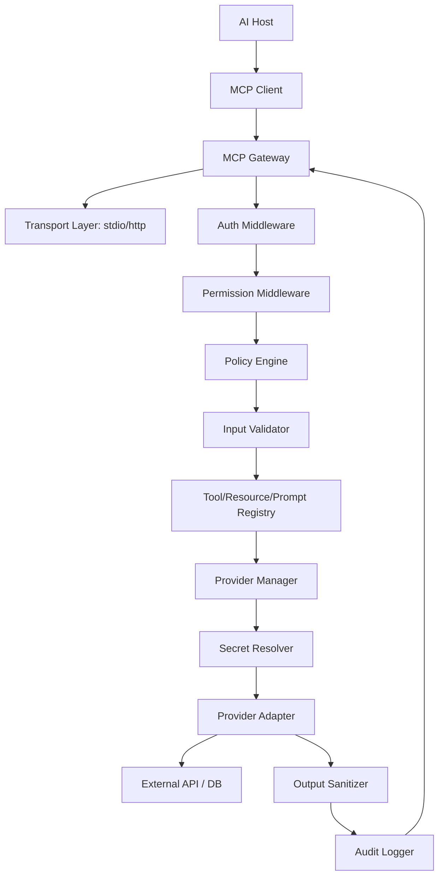

# Architecture: mcp-all-in-one

## 1. Mục tiêu kiến trúc

`mcp-all-in-one` là MCP platform có khả năng kết nối nhiều provider như PostgreSQL, MySQL, Redis, GitHub, GitLab, Slack, Jira, Google Drive, Notion, Docker, Kubernetes và Custom HTTP API mà không làm phình core system.

Core chỉ biết các primitive chung:

- MCP Gateway
- Transport Layer
- Tool Registry
- Resource Registry
- Prompt Registry
- Provider Manager
- Provider SDK / Provider Interface
- Auth & Permission Layer
- Config Loader
- Secret Resolver
- Audit Log
- Observability
- Rate Limit
- Policy Engine
- Output Sanitizer
- Prompt Injection Scanner

Provider cụ thể được implement như plugin/module độc lập trong `src/providers/<provider-name>`.

## 2. Nguyên tắc thiết kế

### 2.1 Core không biết provider cụ thể

Core không import trực tiếp `postgres`, `github`, `slack`. Provider được đăng ký qua `ProviderManifest` và `MCPProviderFactory`.

Sai:

```ts
if (providerName === 'postgres') {
  return new PostgresProvider();
}
```

Đúng:

```ts
const provider = await providerManager.loadProvider(manifest, runtimeConfig);
registry.registerTools(provider.getTools(), provider);
```

### 2.2 Provider là module có manifest rõ ràng

Mỗi provider phải khai báo:

- name, type, version
- config schema
- tools/resources/prompts
- permission requirements
- risk level
- timeout/retry/rate limit defaults
- secret references required
- security checklist

### 2.3 Security enforced server-side

LLM output không phải quyết định bảo mật. Tất cả tool call phải đi qua middleware phía server.

## 3. Component diagram



Secret chỉ đi từ `Secret Resolver` đến `Provider Adapter`. Secret không đi ngược về MCP result, prompt/context hoặc audit log.

## 4. Request lifecycle

```text
Tool Call
  -> Request Context tạo request_id/correlation_id
  -> Auth Check
  -> Permission Check
  -> Policy Evaluation
  -> Prompt Injection / Taint Check nếu payload/context có untrusted data
  -> Input Validation theo input schema
  -> Secret Resolve theo secret_ref cần thiết
  -> Provider Call
  -> Output Sanitization / Redaction
  -> Classification + Taint Metadata
  -> Audit Log
  -> MCP Result trả về client
```

## 5. Folder structure đề xuất

```text
mcp-all-in-one/
  package.json
  tsconfig.json
  README.md

  configs/
    providers.example.yaml
    permissions.example.yaml
    tenants.example.yaml
    policies.example.yaml

  docs/
    architecture.md
    security-model.md
    secret-management.md
    provider-development-guide.md
    configuration-guide.md
    permission-model.md
    threat-model.md
    prompt-injection-defense.md
    roadmap.md
    adr/
      0001-plugin-provider-architecture.md
      0002-secret-boundary-and-redaction.md
      0003-tainted-data-policy.md

  src/
    index.ts
    core/
      gateway/
        mcp-gateway.ts
      transport/
        transport.ts
        stdio-transport.ts
      registry/
        tool-registry.ts
        resource-registry.ts
        prompt-registry.ts
      provider/
        types.ts
        provider-manager.ts
        provider-manifest-validator.ts
      config/
        config-loader.ts
        schemas.ts
      secrets/
        secret-resolver.ts
        env-secret-source.ts
      security/
        request-context.ts
        permission-engine.ts
        policy-engine.ts
        approval-service.ts
        output-sanitizer.ts
        prompt-injection-scanner.ts
        taint.ts
      audit/
        audit-logger.ts
      observability/
        logger.ts
        metrics.ts
        tracing.ts
      errors/
        errors.ts
        error-normalizer.ts

    providers/
      postgres/
        manifest.ts
        index.ts
        tools.ts
        policy.ts
        schemas.ts
        README.md
      github/
        manifest.ts
        index.ts
        tools.ts
        schemas.ts
        README.md

  tests/
    security/
      prompt-injection-scanner.test.ts
      policy-engine.test.ts
    providers/
      postgres-policy.test.ts
```

## 6. Provider plugin architecture

Provider module export factory:

```ts
export const manifest: ProviderManifest = {...};
export function createProvider(): MCPProviderFactory { ... }
```

Core load sequence:

1. Config Loader đọc `configs/providers.yaml`.
2. Provider Manager tìm provider module theo `type`.
3. Provider Manifest Validator validate manifest.
4. Tool Metadata Validator scan tool descriptions/prompts.
5. Provider initialize với runtime config đã resolve secret lazily.
6. Registry đăng ký tools/resources/prompts.
7. Gateway expose MCP tools/resources/prompts cho client.

## 7. Registries

### Tool Registry

- Map `tool.name -> provider instance`.
- Enforce unique tool names.
- Không cho runtime tool mutation nếu chưa re-approval.
- Store manifest checksum/version.

### Resource Registry

- Map URI scheme/prefix đến provider.
- Resource content trả về phải gắn trust metadata và tainted status.

### Prompt Registry

- Chỉ load prompt template đã versioned/reviewed.
- Provider không được inject system prompt runtime.
- Prompt template thay đổi phải require review.

## 8. Multi-connection provider

Provider có thể quản lý nhiều connection/account.

Ví dụ PostgreSQL:

```yaml
postgres:
  connections:
    fintech_user_db:
      host: localhost
      database: fintech_user
      username_ref: env:POSTGRES_USER
      password_ref: env:POSTGRES_PASSWORD
    fintech_ledger_db:
      host: localhost
      database: fintech_ledger
      username_ref: env:POSTGRES_LEDGER_USER
      password_ref: env:POSTGRES_LEDGER_PASSWORD
```

Tool nhận `connection_id` trong input:

```json
{
  "connection_id": "fintech_ledger_db",
  "sql": "SELECT * FROM journal_entries LIMIT 10"
}
```

Provider chịu trách nhiệm map `connection_id` sang connection runtime đã authorize.

## 9. Scale roadmap

### Phase 1: Modular monolith

- Một MCP gateway process.
- Providers loaded in-process.
- Config YAML.
- Env secret resolver.
- PostgreSQL readonly, GitHub read-only.

### Phase 2: Runtime reload + async

- Provider hot reload có guard/version diff.
- Config reload an toàn.
- Redis cache.
- Queue cho long-running tools.

### Phase 3: Remote provider workers

- Provider execution service.
- Provider worker pool.
- Horizontal scaling với load balancer.
- Multi-tenant config store.
- Admin API.

### Phase 4: Marketplace / sandbox

- Provider package registry.
- Signature verification.
- Sandbox execution cho untrusted providers.
- Network egress policy.
- Provider review workflow.

## 10. Khi nào tách provider thành service riêng

Tách provider ra worker/service riêng khi:

- API chậm, scan repo lớn, index tài liệu, hoặc job dài.
- Provider cần CPU/memory/network riêng.
- Provider có rủi ro bảo mật cao, ví dụ Kubernetes/Docker shell-like execution.
- Provider cần secret isolation mạnh hơn.
- Provider có dependency native nặng hoặc conflict.
- Provider cần scale độc lập theo tenant.

## 11. Migration strategy nếu repo đã có code

1. Freeze tool names hiện có và inventory toàn bộ provider-specific logic.
2. Tạo `src/core` trước, chưa đổi behavior.
3. Bọc tool hiện có vào `MCPProvider` adapter.
4. Chuyển config secret sang `secret_ref`.
5. Thêm permission/policy/audit middleware trước provider call.
6. Thêm sanitizer và scanner ở output boundary.
7. Tách provider từng bước sang `src/providers/<name>`.
8. Thêm ADR cho mọi quyết định phá vỡ backward compatibility.
